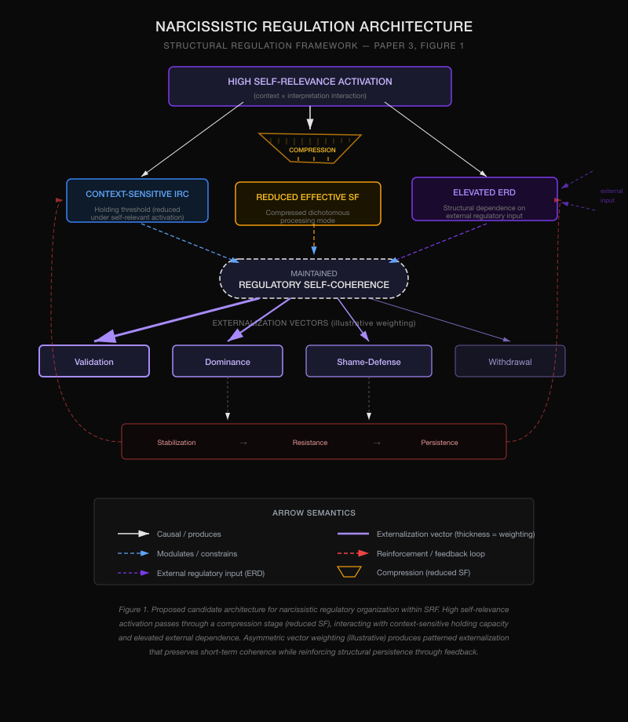
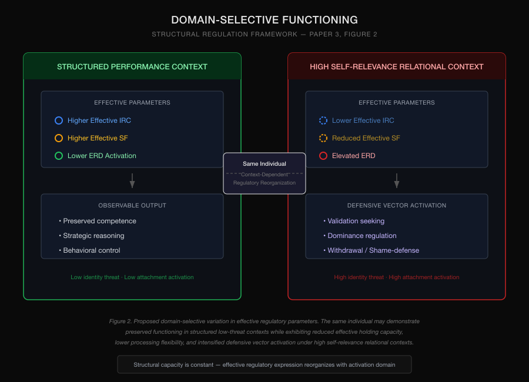

# Narcissistic Organization as Defensive Regulation Architecture
## A Structural Regulation Framework Application

**Series**: Structural Regulation Framework, Paper 3

---

## Abstract

Narcissistic organization presents a longstanding theoretical challenge because it combines preserved or even exceptional functioning in some domains with profound relational instability, dependency intolerance, defensive rigidity, and marked sensitivity to self-relevant threat. Existing theories have described these phenomena through diverse conceptual vocabularies, including object relations, self psychology, dimensional narcissism models, and interpersonal formulations. The present paper does not seek to replace these traditions, but proposes a structural reinterpretive application of the Structural Regulation Framework (SRF).

Within this framework, some narcissistic configurations are conceptualized as defensive regulation architectures characterized by elevated dependence on external stabilization, reduced effective processing flexibility under high self-relevance activation, and patterned reliance on directional regulatory outputs ("vectors") such as validation-seeking, dominance, shame-defense, and withdrawal. Grandiose and vulnerable narcissistic presentations are reinterpreted not as categorically distinct architectures, but as differing dominant vector weightings within a shared regulatory system.

Building on a companion unpublished conceptual manuscript on Resolution Resistance, the paper further proposes that narcissistic rigidity may reflect structural stabilization rather than mere unwillingness to change. Defensive compression may preserve short-term coherence while obstructing the conditions required for durable structural transformation. This leads to the proposed Dependency Double Bind: systems that may require relational scaffolding for structural change may simultaneously organize defensively against conscious acknowledgment of dependency.

The framework also proposes a domain-selective interpretation of narcissistic functioning, suggesting that preserved competence in structured performance environments may coexist with marked dysregulation in high self-relevance interpersonal contexts due to context-sensitive variation in effective regulatory parameters.

This paper is conceptual and presents no original empirical data. Its contribution lies not merely in reinterpretation, but in integrating diverse narcissistic phenomena into a unified structural regulation architecture that generates testable predictions regarding vector transitions, domain-selective functioning, dependency intolerance, and resistance to structural change.

**Keywords:** narcissism; self-regulation; emotion regulation; personality organization; defensive processes; dependency; mentalization; structural regulation

---

# 1. Introduction

Narcissistic organization presents a persistent theoretical challenge because it appears to combine features that are often treated as conceptually difficult to reconcile. Some individuals exhibiting narcissistic patterns may demonstrate preserved or even exceptional functioning in structured domains, including strategic reasoning, professional competence, emotional restraint, and social effectiveness, while simultaneously showing profound instability in intimate relationships, extreme sensitivity to criticism, rigid defensive responses, dependency intolerance, or abrupt shifts in interpersonal presentation.

This apparent contradiction has been addressed through multiple theoretical traditions. Object relations formulations have emphasized splitting, fragile internal object representations, aggression, and unstable self–other organization. Self psychological models have focused on mirroring needs, selfobject dependence, fragmentation risk, and deficits in self-cohesion. Contemporary dimensional models have increasingly described narcissism in terms of grandiose and vulnerable expressions, antagonistic self-regulation, fluctuating state dynamics, and interpersonal self-enhancement strategies.

Each of these perspectives contributes important explanatory insight. The present paper does not seek to replace them.

Instead, it asks whether several clinically recognizable narcissistic phenomena that are often treated separately may be structurally integrated within a unified regulation architecture.

The present contribution is not merely the descriptive reinterpretation of familiar narcissistic phenomena in alternative terminology. Its more specific aim is to test whether fluctuating grandiose and vulnerable presentations, selective preserved functioning, defensive rigidity, dependency intolerance, and patterned interpersonal destabilization can be coherently modeled within a single structural regulation framework that generates distinct dynamic predictions.

The interpretive foundation for this effort is the Structural Regulation Framework (SRF; Halmetoja, 2026), a conceptual model proposing that psychological regulation may be usefully understood in terms of interacting structural parameters rather than exclusively descriptive symptom categories or developmental narratives.

Within SRF, three proposed dimensions are particularly relevant:

- **Internal Regulation Capacity (IRC):** the effective ability of a regulatory system to sustain destabilizing self-relevant activation without immediate defensive reorganization.
- **Structural Flexibility (SF):** the effective capacity for maintaining integrated, non-defensive processing under activation.
- **External Regulation Dependence (ERD):** the degree to which stable self-coherence depends on external interpersonal stabilization.

A companion unpublished conceptual manuscript further proposed the concept of **Resolution Resistance** (Halmetoja, 2026b), suggesting that some defensive architectures may persist not despite maladaptive features, but because those features preserve short-term regulatory stability under conditions where structural change would initially increase destabilization.

Applied to narcissistic organization, this possibility becomes especially interesting. If certain narcissistic defensive patterns serve active short-term regulatory functions, apparent rigidity may become structurally intelligible rather than merely motivationally frustrating. Likewise, if preserved competence varies systematically across activation contexts, apparently contradictory functioning may reflect context-sensitive regulatory reorganization rather than categorical inconsistency.

The present paper explores narcissistic organization as one candidate application of SRF. Specifically, it proposes that some narcissistic configurations may be understood as defensive regulation architectures characterized by elevated external stabilization dependence, reduced effective processing flexibility under high self-relevance activation, and patterned reliance on directional regulatory outputs ("vectors") such as validation-seeking, dominance, shame-defense, and withdrawal.

Under this interpretation, grandiose and vulnerable narcissistic presentations are not necessarily categorically distinct structural organizations, but may reflect differing dominant vector weightings within a shared architecture.

The paper further proposes three broader claims:

1. Narcissistic rigidity may reflect structural stabilization rather than simple unwillingness to change.
2. Dependency-related resistance may emerge through a specific structural paradox in which systems that require relational scaffolding for transformation simultaneously organize defensively against conscious dependency recognition.
3. Preserved competence and severe relational dysregulation may coexist through domain-selective variation in effective regulatory parameters.

These claims remain conceptual and speculative. No empirical validation is offered here. The purpose of the present paper is narrower: to evaluate whether a structural regulation interpretation provides explanatory coherence, clinically recognizable insight, and testable hypotheses that extend beyond purely descriptive narcissism formulations.

---

# 2. Mapping Narcissistic Organization onto SRF

The Structural Regulation Framework proposes that psychological organization may be interpreted through interacting regulatory parameters rather than static descriptive traits alone. Applied to narcissistic organization, this framework suggests the possibility that many clinically recognized narcissistic phenomena may be structurally understandable as recurrent configurations within a shared regulation architecture.

The present interpretation remains conceptual. It does not claim that narcissism can be exhaustively reduced to SRF parameters, nor that all narcissistic presentations share identical structural organization. Rather, the present question is whether recognizable narcissistic configurations may be coherently mapped onto the proposed SRF dimensions.

## 2.1 Internal Regulation Capacity (IRC)

Internal Regulation Capacity refers to the effective ability of a regulatory system to sustain destabilizing activation without immediate defensive reorganization.

In narcissistic contexts, many clinically recognizable destabilizing conditions involve high self-relevance activation, including shame exposure, criticism, dependency threat, relational invalidation, status destabilization, perceived humiliation, and asymmetry exposure.

Under the present interpretation, some narcissistic configurations may exhibit relatively low effective IRC under such conditions. This does not imply globally impaired functioning. Rather, the relevant claim concerns threshold sensitivity: a system may appear highly organized under ordinary or structured conditions while demonstrating rapid destabilization once specific activation thresholds are exceeded.

## 2.2 Structural Flexibility (SF)

Structural Flexibility refers to the effective capacity for maintaining integrated, non-defensive processing under destabilizing activation.

Within narcissistic contexts, clinically recognizable features such as dichotomous appraisal, contradiction intolerance, polarized self–other evaluation, rigid certainty, and rapid defensive simplification may suggest reductions in effective flexibility under high self-relevance activation.

Importantly, this formulation does not frame reduced flexibility merely as deficit. As explored later through Resolution Resistance, defensive simplification may perform active stabilizing functions. Under this interpretation, rigid certainty, external blame, idealization, devaluation, or defensive polarization may temporarily preserve coherence by reducing ambiguity and contradiction.

## 2.3 External Regulation Dependence (ERD)

External Regulation Dependence refers to the degree to which stable self-coherence depends on external interpersonal stabilization.

This formulation intentionally distinguishes functional regulatory dependence from conscious subjective dependency experience. A system may remain structurally dependent on external regulation while simultaneously organizing defensively against explicit acknowledgment of need.

Applied to narcissistic organization, this distinction becomes particularly important. Validation, admiration, reflected worth, dominance asymmetry, or environmental control may all function as regulatory maintenance mechanisms rather than merely interpersonal preferences. This helps explain why overt anti-dependency presentation may coexist with profound reactivity to invalidation or criticism.

## 2.4 Candidate Configuration

Taken together, the present interpretation suggests that some narcissistic configurations may often occupy a regulatory region characterized by:

- relatively low effective IRC under high self-relevance activation,
- reduced effective SF under destabilizing conditions,
- elevated ERD,
- patterned defensive vector outputs.

This should not be interpreted as universal classification. Rather, it represents a candidate structural configuration that appears clinically recognizable and theoretically testable.

## 2.5 Selective Compression Rather Than Global Dysfunction

A critical clarification: the present framework does not propose that narcissistic organization reflects globally impaired regulatory capacity. Rather, it proposes a selective compression architecture — a characteristic pattern in which some signal classes are processed at high resolution while others are severely compressed.

A candidate narcissistic compression profile (developed more fully in Halmetoja, 2026d):

| Signal class | Effective resolution |
|---|---|
| Status | High |
| Strategic reasoning | High |
| Control | Moderate-high |
| Shame | Very low |
| Dependency | Very low |
| Rejection | Very low |
| Separateness | Very low |

This explains the clinically observed paradox of sophisticated competence coexisting with relational primitiveness — not as inconsistency or masking, but as the natural expression of a selective compression architecture. The system is not globally impaired. It is selectively compressed in specific signal classes while maintaining or exceeding normal resolution in others.

---

# 3. Defensive Vector Architecture

If narcissistic regulation is interpreted structurally rather than purely descriptively, an important question follows: How does destabilizing activation leave the system?

The present framework proposes that externalization may not occur as undifferentiated discharge, but through patterned directional outputs — regulatory vectors. These vectors are not intended as exhaustive behavioral taxonomies. Rather, they represent candidate regulatory pathways through which destabilizing activation may be redistributed, neutralized, or externally reorganized.

## 3.1 Validation Vector

Validation-seeking represents perhaps the most intuitively recognizable regulatory vector. Under this interpretation, validation is not merely desirable affirmation. It may function as direct external stabilization.

Admiration, reassurance, reflected worth, idealized mirroring, or relational confirmation may temporarily restore coherence in systems with elevated external regulation dependence. When this vector dominates, destabilization may produce intensified admiration seeking, reassurance extraction, impression management, or efforts to restore reflected worth.

## 3.2 Dominance Vector

Dominance may function as a structurally distinct regulatory pathway. Rather than restoring stability through explicit affirmation, dominance may regulate through environmental asymmetry.

Control reduces unpredictability. Asymmetry reduces vulnerability. Subordination of others reduces exposure to destabilizing contradiction. Under this interpretation, dominance behavior is not necessarily reducible to aggression or status pursuit alone. It may function as regulatory architecture.

## 3.3 Shame-Defense Vector

Shame-defense represents rapid defensive redistribution of destabilizing self-relevant activation. External blame, retaliatory attack, contempt, projection, devaluation, or moral inversion may serve to neutralize internally destabilizing material before deeper processing occurs.

This vector may become especially active under humiliation, criticism, dependency exposure, or identity threat.

## 3.4 Withdrawal Vector

Not all defensive vectors require overt interpersonal action. Withdrawal may regulate by reducing exposure itself. Emotional retreat, disengagement, avoidance, collapse signaling, or relational distancing may function as activation reduction strategies.

Within some narcissistic configurations, withdrawal may be particularly relevant in vulnerable-dominant presentations.

## 3.5 Vector Dynamics

A key implication of this framework is that destabilizing activation need not produce identical responses across contexts. Different triggering conditions may preferentially activate different vectors. For example:

- admiration disruption may activate validation seeking,
- humiliation may activate shame-defense,
- control threat may activate dominance,
- dependency destabilization may activate withdrawal.

Multiple vectors may also operate sequentially or in rapid alternation. This interpretation moves beyond static trait description toward dynamic regulatory organization.

---

# 4. Mirroring Dependency and External Regulation

A longstanding clinical observation in narcissistic formulations concerns apparent contradiction between overt independence and profound sensitivity to external interpersonal response. Self psychological traditions have emphasized mirroring needs and selfobject dependence, while contemporary formulations frequently describe contingent self-worth, admiration dependence, or destabilization following invalidation.

The present framework offers a structural reinterpretation of these phenomena through External Regulation Dependence (ERD). Under this interpretation, explicit subjective dependency and functional regulatory dependency must be distinguished. A system may consciously present as autonomous, dismissive, superior, or emotionally self-sufficient while remaining structurally dependent on external stabilization for maintenance of effective self-coherence.

This distinction is important because dependency, in the present framework, is defined functionally rather than phenomenologically. The relevant question is not whether the individual consciously experiences dependency. The question is whether regulatory stability becomes measurably contingent on external interpersonal conditions.

Under this interpretation, admiration, validation, reflected importance, compliance extraction, idealized attachment, or asymmetry maintenance may function as regulatory mechanisms rather than merely interpersonal preferences. This helps explain why apparently minor invalidation may produce disproportionate destabilization. The destabilizing event may not simply be social disappointment. It may represent disruption of active regulatory infrastructure.

## 4.1 Mirroring as Structural Stabilization

Within self psychological traditions, mirroring has often been conceptualized developmentally. The present framework does not contest that perspective. Instead, it offers a structural reinterpretation.

Mirroring may be understood not only as developmental need fulfillment, but as active real-time regulatory stabilization. Under elevated ERD, reflected worth may function analogously to externally supplied coherence maintenance. When mirroring remains available, effective self-coherence is preserved. When mirroring fails, destabilization increases.

This interpretation offers a more explicitly regulatory explanation for why admiration dependence may appear structurally necessary rather than merely emotionally gratifying.

## 4.2 Dependency Concealment

A central paradox emerges. If dependency threatens identity coherence, explicit acknowledgment of dependency becomes destabilizing. Thus, systems may organize around dependency while simultaneously defending against conscious recognition of that dependency.

In some narcissistic configurations, explicit recognition of need may itself function as high self-relevance threat activation. As a result, externally dependent configurations may instead appear disguised as superiority, contempt, detachment, hyper-independence, or entitlement.

---

# 5. Grandiose and Vulnerable Presentations as Vector Weightings

Contemporary narcissism literature often distinguishes grandiose and vulnerable presentations. These distinctions are clinically useful and empirically supported. The present framework does not reject them. Instead, it proposes a structural reinterpretation.

Grandiose and vulnerable narcissistic presentations may not necessarily represent categorically distinct architectures. They may instead reflect differing dominant vector weightings within a shared regulatory configuration.

## 5.1 Grandiose-Dominant Configurations

In grandiose-dominant configurations, validation and dominance vectors may be preferentially weighted. Destabilization may be regulated through admiration extraction, impression control, superiority assertion, competitive asymmetry, contempt, or retaliatory self-enhancement.

Preserved functioning may appear high in structured domains where these strategies remain effective. Such individuals may appear confident, decisive, charismatic, emotionally controlled, or unusually resilient. Under the present interpretation, however, these features do not necessarily imply globally high structural flexibility or internal regulation capacity. They may reflect effective vectorized stabilization under specific conditions.

## 5.2 Vulnerable-Dominant Configurations

In vulnerable-dominant configurations, withdrawal and shame-defense vectors may be more heavily weighted. Destabilization may manifest through collapse signaling, retreat, sensitivity amplification, passive hostility, defensive victim positioning, or dependency protest.

The present framework proposes that the underlying structural configuration may remain broadly similar, even if outward presentation differs substantially. This helps explain why vulnerable narcissistic presentations may sometimes be mistaken for entirely separate psychological organizations.

## 5.3 Dynamic Reweighting

A key implication of this interpretation is that presentation need not be fixed. The same individual may shift between vector-dominant states depending on context, activation intensity, relational conditions, or perceived threat.

This dynamic interpretation aligns with increasing recognition that narcissistic expression is often state-sensitive rather than rigidly categorical. The proposed contribution lies in offering a structural explanation for why such shifts occur. Rather than treating presentation changes as inconsistent personality expression, SRF interprets them as changes in dominant stabilization strategy.

---

# 6. Resolution Resistance in Narcissistic Organization

A persistent clinical question concerns why some narcissistic defensive patterns appear highly resistant to change, even when those patterns produce substantial relational cost. Traditional explanations often emphasize motivation, defensive rigidity, lack of insight, entitlement, or resistance.

The present framework offers a different interpretation. Some narcissistic configurations may be especially resistant because defensive architecture actively preserves short-term structural stability.

## 6.1 Defensive Compression as Stabilization

Reduced effective Structural Flexibility may not merely represent impairment. It may function as active defensive compression. Ambiguity reduction, contradiction simplification, polarized interpretation, and rapid certainty formation may temporarily preserve coherence by reducing destabilizing complexity.

Under this interpretation, dichotomous appraisal is not merely inaccurate cognition. It may be structural stabilization.

## 6.2 Why Change Becomes Dangerous

Structural change may require temporary destabilization of defensive coherence. This creates a difficult paradox. If the existing organization preserves stability, then loosening that organization initially increases destabilization. The individual may temporarily become less coherent before becoming more integrated.

Where effective Internal Regulation Capacity is limited, this transitional destabilization may become intolerable. Thus, several structural features may amplify resistance:

- low tolerance for destabilizing activation,
- reduced effective integrative flexibility,
- elevated dependence on external stabilization,
- defensive vector efficiency.

Resistance becomes structurally intelligible.

## 6.3 From Resistance to Resolution Resistance

The companion conceptual manuscript on Resolution Resistance (Halmetoja, 2026b) proposed that some defensive systems may persist not because they fail to change, but because defensive architecture successfully prevents destabilization required for structural transformation.

Applied here, narcissistic rigidity may be understood as structurally adaptive in the short term. The system resists not because change is cognitively rejected, but because destabilization itself threatens coherence.

---

# 7. The Dependency Double Bind

If structural change requires destabilization, and destabilization exceeds available internal regulatory tolerance, an important clinical question emerges: How does transformation occur?

One intuitive answer is relational scaffolding. External stabilization may temporarily support transition. However, within some narcissistic configurations, this question becomes especially acute.

## 7.1 The Structural Paradox

The paradox can be stated simply: A system may require dependency-mediated stabilization for transformation while simultaneously organizing defensively against conscious dependency recognition.

This creates the proposed Dependency Double Bind. Dependency may be structurally necessary. Dependency recognition may be structurally threatening. Thus, the very condition that could support change may trigger defensive reorganization.

In signal-class terms (Halmetoja, 2026d), this paradox may be understood as severe compression of the dependency signal class: the system cannot process dependency-relevant information at sufficient resolution to tolerate conscious acknowledgment of need.

## 7.2 Why Dependency Recognition Becomes Threatening

In some narcissistic configurations, explicit recognition of need may activate shame, inferiority, asymmetry exposure, loss of superiority identity, or vulnerability salience.

Under reduced effective Structural Flexibility, such activation may not be readily integrated. Instead, destabilization may rapidly recruit defensive vectors. This helps explain why dependency-related therapeutic moments may provoke rupture rather than progress.

## 7.3 Candidate Clinical Implication

The present framework does not claim this mechanism is unique to narcissism. Related paradoxes likely exist elsewhere. The proposed contribution is narrower: it suggests that elevated ERD combined with dependency-intolerant identity organization may make this paradox especially structurally significant in some narcissistic configurations.

This hypothesis is conceptually testable.

---

# 8. Domain-Selective Functioning

One clinically puzzling feature observed across many narcissistic presentations is marked functional inconsistency. The same individual may demonstrate preserved or exceptional competence in some contexts while showing severe dysregulation in others.

Traditional interpretations may frame this as inconsistency, compartmentalization, masking, or contextual variability. The present framework proposes a structural interpretation.

## 8.1 Context-Sensitive Effective Parameters

SRF does not require regulatory parameters to remain globally constant across contexts. Effective Internal Regulation Capacity, Structural Flexibility, and External Regulation Dependence may vary substantially depending on activation conditions.

This creates the possibility of domain-selective reorganization. The same individual may function effectively in domains that minimize emotionally self-relevant interpersonal activation while destabilizing in contexts involving attachment relevance, shame exposure, dependency threat, humiliation risk, or relational asymmetry.

## 8.2 Structured Performance Domains

Structured domains often contain features that reduce destabilization: clear rules, predictable contingencies, reduced emotional ambiguity, lower dependency salience, and explicit performance criteria.

Under such conditions, effective IRC and SF may remain sufficiently high for preserved competence. This helps explain how individuals may demonstrate strategic reasoning, professional success, behavioral discipline, and persuasive social performance.

## 8.3 High Self-Relevance Relational Domains

By contrast, high self-relevance relational domains may intensify destabilizing activation. In such contexts, ERD becomes more consequential, defensive vectors become more probable, effective integration decreases, and threshold sensitivity increases.

The result is not necessarily global dysfunction. It is context-sensitive reorganization.

## 8.4 Domain-Selective Resolution Hypothesis

The present framework therefore proposes a Domain-Selective Resolution Hypothesis: Psychological resolution capacity may operate domain-specifically, permitting higher-resolution processing in low self-relevance structured contexts while maintaining defensive compression in high self-relevance relational domains where destabilization risk is greatest.

This hypothesis offers one structural explanation for so-called functional narcissistic presentations — reframed here as domain-preserved functioning under attachment-specific compression.

## 8.5 Channel-Dependent Empathy Variation

The selective compression architecture also offers a structural reinterpretation of empathy variation in narcissistic organization. Under the present framework, empathy failure need not reflect global empathic incapacity. Instead, it may emerge as channel-dependent empathy collapse: the system may demonstrate preserved or even sophisticated empathic attunement in low-threat signal classes (professional contexts, abstract reasoning about others' motivations) while showing marked empathic failure specifically when self-threatening signal classes co-activate.

When shame, dependency, or rejection signals activate in the observer's own system, available processing bandwidth for other-directed interpretation may become reduced — not because empathy is globally absent, but because the observer's own compressed channels consume regulatory resources that would otherwise support perspective-taking.

This predicts that empathic failure in narcissistic configurations should be context-specific and threat-dependent rather than uniform — a testable claim that distinguishes the present framework from global empathy deficit models.

{ width=85% }

# 9. Therapeutic Implications (Speculative)

The present paper is not a treatment model. However, if the proposed structural interpretation has explanatory value, certain speculative therapeutic implications follow. These implications should be understood as conceptual rather than prescriptive.

## 9.1 Alliance as Regulatory Event

If elevated External Regulation Dependence contributes to narcissistic stabilization, therapeutic alliance may function not merely as relational context, but as active regulatory infrastructure. This creates both opportunity and risk.

Alliance may provide temporary stabilization that permits structural exploration. At the same time, alliance disruption may produce disproportionate destabilization. Thus, therapeutic relationship events may be structurally consequential rather than merely procedurally relevant.

## 9.2 Transitional Capacity and Destabilization

If structural change requires temporary destabilization of defensive coherence, the clinically relevant question becomes not whether destabilization occurs, but whether it remains within tolerable structural limits.

Under the present framework, excessive destabilization may intensify defensive vector activation rather than integration, while insufficient destabilization may simply preserve existing equilibrium. The therapeutic challenge is therefore not merely pacing in a generic sense, but calibration of transitional destabilization relative to available holding capacity.

## 9.3 Rupture as Structural Information

Therapeutic rupture may provide structurally informative data. Rather than representing treatment failure, rupture may function diagnostically as vector exposure. For example:

- validation rupture may recruit reassurance extraction,
- dependency activation may provoke withdrawal,
- shame exposure may activate attack or defensive inversion,
- asymmetry threat may intensify dominance dynamics.

## 9.4 Dependency Recognition as Structural Risk

The Dependency Double Bind suggests that therapeutic progress may be complicated by the very relational conditions that support change. If conscious dependency recognition itself functions as destabilizing threat, interventions requiring explicit acknowledgment of vulnerability or reliance may activate defensive responses before sufficient structural tolerance exists.

## 9.5 Structurally Oriented Clinical Questions

Rather than prescribing technique, the present framework proposes structurally oriented interpretive questions that may assist clinical formulation:

- Which destabilizing contexts reliably activate defensive vectors?
- Which vectors dominate under which activation conditions?
- Is apparent resistance preserving structural coherence?
- Does preserved competence vary systematically by domain?
- What forms of relational support stabilize without triggering dependency threat?

These questions remain exploratory.

---

# 10. Relationship to Existing Models

The present framework is not proposed as a replacement for existing narcissism theories. Its intended role is interpretive integration.

## 10.1 Relationship to Object Relations Formulations

Object relations models, particularly Kernberg's formulations, emphasize splitting, unstable self–other representations, aggression, and fragile internal organization. These ideas overlap meaningfully with the present framework. Reduced effective Structural Flexibility may partially resemble integrative limitations associated with splitting. Defensive vector outputs may resemble externalized defensive enactments.

However, the present framework differs in emphasis. Rather than primarily describing representational structure, SRF proposes a threshold-sensitive regulation architecture organized around dynamic stabilization under activation.

## 10.2 Relationship to Self Psychology

Self psychological traditions emphasize mirroring, selfobject dependence, fragmentation risk, and maintenance of self-cohesion. These overlaps are substantial. The present interpretation of External Regulation Dependence is especially compatible with self psychological concerns.

However, SRF reframes these phenomena structurally. Rather than focusing primarily on developmental narrative, it asks how real-time regulatory architecture maintains coherence under destabilizing activation.

## 10.3 Relationship to Contemporary Narcissism Models

Contemporary dimensional models distinguish grandiose and vulnerable narcissistic expression. The vector-weighting interpretation proposed here attempts a more explicitly dynamic regulatory explanation for presentation shifts by modeling fluctuations as changes in dominant stabilization strategies under varying activation conditions.

## 10.4 Relationship to Narcissistic Admiration and Rivalry

Back and colleagues' admiration–rivalry model (Back et al., 2013) offers important dimensional clarification. Validation and dominance vectors show clear conceptual overlap. However, SRF extends beyond admiration–rivalry distinctions by embedding these strategies within a broader threshold-sensitive regulation architecture that includes holding capacity, processing flexibility, and context-dependent structural change resistance.

## 10.5 Relationship to Mentalization-Based Perspectives

Mentalization traditions emphasize reflective functioning under emotional activation. This overlaps conceptually with Structural Flexibility. However, SRF proposes a broader systems-level interpretation that includes regulatory thresholds, dependency architecture, vectorized externalization, and stabilization dynamics.

## 10.6 Positioning

SRF does not replace these models. It offers structural unification language. The intended contribution is the introduction of a unified structural regulation architecture capable of generating dynamic predictions regarding vector transitions, domain-selective functioning, and resistance to structural change — predictions that are less explicitly formalized in many existing models.

---

# 11. Testable Predictions

A conceptual framework gains scientific value partly through falsifiability. The present model generates several candidate predictions.

## 11.1 Domain Variation

Individuals exhibiting narcissistic organization should demonstrate measurable variation in effective regulatory functioning across domains differing in shame salience, dependency relevance, or interpersonal threat.

## 11.2 Vector Patterning

Specific destabilizing triggers should preferentially recruit distinct behavioral vector outputs rather than random dysregulation.

## 11.3 Dependency Activation Effects

Explicit dependency-related activation should predict increased defensive reorganization in some narcissistic configurations.

## 11.4 Preserved Structured Performance

Performance-oriented structured environments should correlate with relatively preserved effective regulatory functioning compared with relationally destabilizing environments.

## 11.5 Therapeutic Rupture Patterns

Therapeutic rupture processes may reveal recurring vector dominance under destabilizing activation.

## 11.6 Structural Change Threshold Effects

Structural transformation should display threshold-sensitive nonlinearity rather than gradual trait improvement alone.

{ width=90% }

# 12. Toward Operationalization

The present framework remains conceptual, and no validated instruments currently exist for direct measurement of its proposed constructs. However, the framework's scientific usefulness depends partly on whether its parameters can be operationalized in ways that permit empirical evaluation.

## 12.1 Internal Regulation Capacity (IRC)

Potential empirical proxies may include distress tolerance measures, psychophysiological stress persistence, affect regulation paradigms, and experimentally induced emotional load tasks.

## 12.2 Structural Flexibility (SF)

Potential empirical proxies may include reflective functioning measures, contradiction tolerance paradigms, mentalization assessments, and complexity-based self-description tasks.

## 12.3 External Regulation Dependence (ERD)

Potential empirical proxies may include contingent self-worth measures, interpersonal dependency scales, reassurance-seeking assessment, and ecological momentary interpersonal regulation sampling.

## 12.4 Vector Dominance

Operationalization may require behavioral coding, psychotherapy rupture pattern analysis, ecological momentary behavioral sampling, and trigger-response paradigms.

## 12.5 Domain-Selective Reorganization

Potential empirical designs include structured versus relational context comparison, repeated ecological momentary assessment, psychotherapy process studies, and within-subject activation paradigms.

## 12.6 Operational Caveat

These proposals remain preliminary. The present aim is not premature instrument construction, but demonstration that the framework is empirically approachable rather than purely metaphorical. Whether these constructs prove meaningfully distinct from existing constructs remains an open empirical question.

---

# 13. Limitations

Several limitations should be explicitly acknowledged.

1. The present paper is conceptual and provides no original empirical validation.
2. Substantial construct overlap with existing psychological concepts is possible. The proposed constructs may ultimately prove partially redundant with existing regulation, dependency, or mentalization formulations.
3. Narcissistic organization is clinically heterogeneous. The present framework should not be interpreted as universal classification.
4. Dynamic systems language should not be mistaken for formal mathematical modeling. The present paper proposes conceptual architecture, not computational simulation.
5. The companion Resolution Resistance manuscript remains unpublished. Its claims should therefore be interpreted provisionally.
6. The framework does not model narcissism as a distinct categorical pathology, but as a specific configuration within a continuous regulatory space. This positioning may be incompatible with categorical diagnostic traditions.
7. The present paper treats SRF parameters (IRC, SF, ERD) as global constructs applied to narcissistic organization. A companion paper (Halmetoja, 2026d) proposes that these parameters may operate signal-class-specifically, which would refine the present application toward signal-class-specific compression profiles rather than global parameter descriptions.
8. The present paper does not address defensive reality reconstruction — the phenomenon whereby accessible subjective reality itself becomes altered under regulatory pressure. Clinically recognizable narcissistic phenomena such as narrative distortion, contradiction-resistant self-justification, confabulatory reinterpretation, and event revision are not fully explained by compression alone (which reduces resolution) but may involve active reconstruction of accessible reality. This represents a genuine explanatory gap in the current framework. The present paper acknowledges compression and vector activation but does not yet formalize the transition from intolerable representational cost to altered subjective reality. This domain may warrant future theoretical development.

These limitations are substantial. The present contribution should therefore be evaluated primarily as theoretical synthesis and hypothesis generation.

---

# 14. References

Back, M. D., Küfner, A. C. P., Dufner, M., Gerlach, T. M., Rauthmann, J. F., & Denissen, J. J. A. (2013). Narcissistic admiration and rivalry: Disentangling the bright and dark sides of narcissism. *Journal of Personality and Social Psychology*, 105(6), 1013–1037. https://doi.org/10.1037/a0034431

Bateman, A. W., & Fonagy, P. (2004). *Psychotherapy for borderline personality disorder: Mentalization-based treatment*. Oxford University Press.

Blatt, S. J. (2008). *Polarities of experience: Relatedness and self-definition in personality development, psychopathology, and the therapeutic process*. American Psychological Association.

Cain, N. M., Pincus, A. L., & Ansell, E. B. (2008). Narcissism at the crossroads: Phenotypic description of pathological narcissism across clinical theory, social/personality psychology, and psychiatric diagnosis. *Clinical Psychology Review*, 28(4), 638–656. https://doi.org/10.1016/j.cpr.2007.09.006

Fonagy, P., Gergely, G., Jurist, E. L., & Target, M. (2002). *Affect regulation, mentalization, and the development of the self*. Other Press.

Gross, J. J. (2015). Emotion regulation: Current status and future prospects. *Psychological Inquiry*, 26(1), 1–26. https://doi.org/10.1080/1047840X.2014.940781

Halmetoja, J. (2026a). Structural Regulation Framework (SRF). Zenodo. https://doi.org/10.5281/zenodo.20215822

Halmetoja, J. (2026b). Resolution Resistance: A structural model of why regulation architectures resist change. Zenodo. https://doi.org/10.5281/zenodo.20379672

Halmetoja, J. (2026d). Compression Profiles: A signal-class architecture of differential psychological resolution. Zenodo. https://doi.org/10.5281/zenodo.20382973

Kernberg, O. F. (1975). *Borderline conditions and pathological narcissism*. Jason Aronson.

Kernberg, O. F. (1984). *Severe personality disorders: Psychotherapeutic strategies*. Yale University Press.

Kohut, H. (1971). *The analysis of the self*. International Universities Press.

Kohut, H. (1977). *The restoration of the self*. International Universities Press.

Krizan, Z., & Herlache, A. D. (2018). The narcissism spectrum model: A synthetic view of narcissistic personality. *Personality and Social Psychology Review*, 22(1), 3–31. https://doi.org/10.1177/1088868316685018

Mikulincer, M., & Shaver, P. R. (2007). *Attachment in adulthood: Structure, dynamics, and change*. Guilford Press.

Miller, J. D., Lynam, D. R., Hyatt, C. S., & Campbell, W. K. (2017). Controversies in narcissism. *Annual Review of Clinical Psychology*, 13, 291–315. https://doi.org/10.1146/annurev-clinpsy-032816-045244

Pincus, A. L., & Lukowitsky, M. R. (2010). Pathological narcissism and narcissistic personality disorder. *Annual Review of Clinical Psychology*, 6, 421–446. https://doi.org/10.1146/annurev.clinpsy.121208.131215

Ronningstam, E. (2012). Alliance building and narcissistic personality disorder. *Journal of Clinical Psychology*, 68(8), 943–953. https://doi.org/10.1002/jclp.21898

Safran, J. D., & Muran, J. C. (2000). *Negotiating the therapeutic alliance: A relational treatment guide*. Guilford Press.
